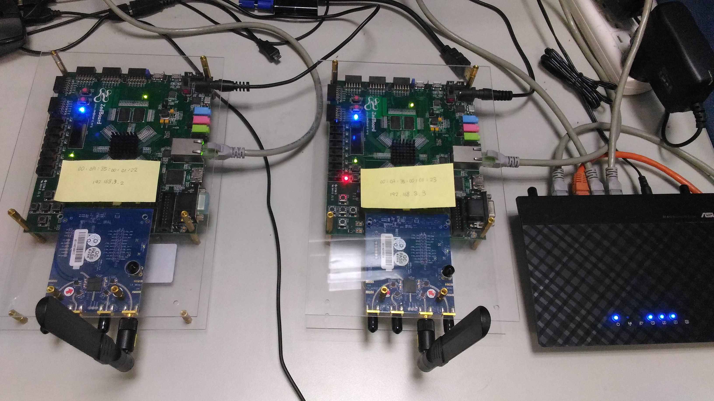
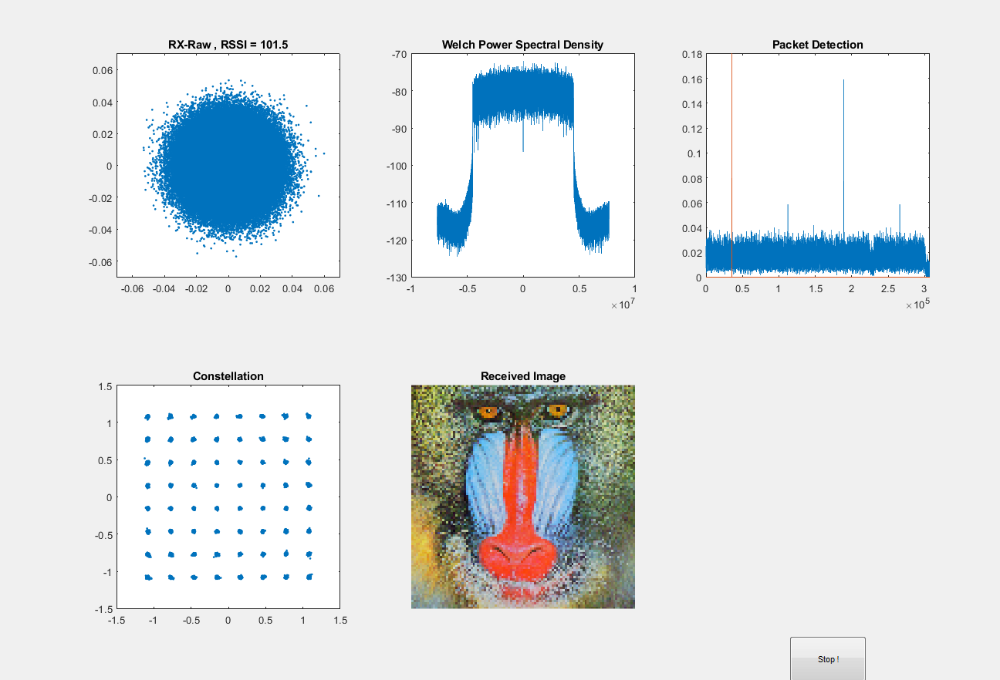
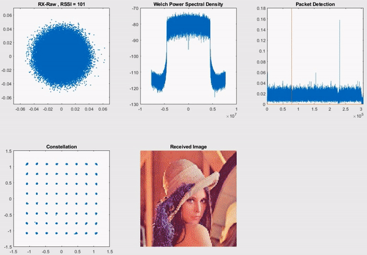
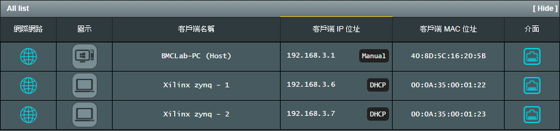

# SDR_Matlab_LTE
This simple OFDM demo is based on LTE downlink format for testing SDR hardware.

Using Software Designed Radio (SDR) to transmit OFDM signals at 2.4 GHz.

Transmitter and Receiver hardware : Zedboard (Xilinx Zynq®-7000) + AD9361 (Analog Device-FMCOMMS3)

# Software used :

* [Libiio Library](https://github.com/analogdevicesinc/libiio/releases)
* [Zynq Linux Image](https://wiki.analog.com/resources/tools-software/linux-software/zynq_images)

# Code Structure :
* `Main_self.m` for one transceiver
* `Main_TwoBoard.m` for transmitter and receiver

# GUI_RX

## TX RX Hardware Parameters
| Center Frequency                 | 2.4 GHz                          |
|:--------------------------------:|:--------------------------------:|
| Bandwidth                        | 10 MHz                           |
| Sampling Rate                    | 15.36 MS/s                       |
| Mapping                          | 64 QAM                           |
| FFT Size                         | 1024                             |
| Cyclic Prefix Length             | 80 (symbol#0), 72(symbol#1~6)    |
| Resource Block                   | 50                               |
| Samples Per Frame                | 307200                           |
| PC Host IP address               | 192.168.3.1                      |
| TX IP address                    | 192.168.3.6                      |
| RX IP address                    | 192.168.3.7                      |

# Change Hardware IP / Mac address
Edit `/etc/init.d/rc.local` file in Linux OS

Router DHCP hand setting mode to distribute network configuration parameters :

